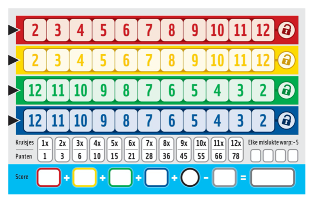
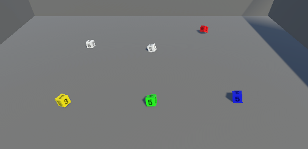
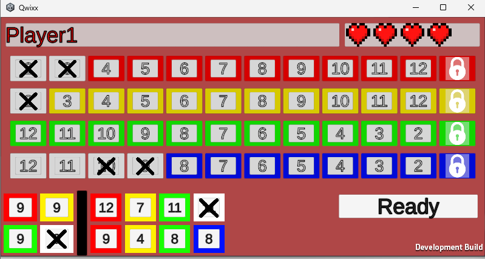

# Qwixx
## Introduction
Welcome to my version of Qwixx, a simple dice game that was introduced to my family by my older sister.  
In this project, I am remaking this game to be a multiplayer experience where a laptop plays the role of the host and each user connects to it with their own mobile device.

## The rules
### The game pieces
The pieces of the game are fairly simple, there are 6 dice, 2 white ones and 4 colored ones. Other than that all you need is one scoresheet per player (pictured below) and somethig to fill it in.

### The flow of the game
The game goes as follows: each player takes turns throwing the dice. The dice decide what squares of the scoresheet you can cross off.  
  
Any player can take the sum of the white dice and cross of that number in any single row of the player's choosing, I will call this the *white throw*. The player that threw the dice is allowed to do this **AND** they are allowed to make one combination of either white die and any colored die to cross of a square in the chosen die's color, I will call this the *coloured throw*.
    
If the player who threw the dice doesn't cross any squares during their turn, they mark a *failed throw*. For a valid turn, the player doesn't need to pick the white throw **AND** the coloured throw, either of them is valid.

Once a square has been crossed off, you can only cross the squares to the right of it in next turns. Squares to the left are **locked** and can no longer be accessed.

### Locking a row
The final square of any row is connected to a lock. When this final square is crossed off, the player doing this can lock the row for everyone by crossing the lock as well. When the lock is crossed, the row is locked for everyone and no player can cross any more squares in this row.
  
A row can only be locked by a player if they already crossed off 5 other squares in that row.
  
If the white dice indicate that multiple players can lock the same row at the same time, this is completely possible.

### The end of the game
The game ends when 2 rows are locked off or if any player has 4 failed throws. After the game ends, all players calculate their scores per row by using the lookup table at the bottom of the scoresheet. The amount of crosses per row translate to a score. If a lock is crossed off, this also counts to that total. Add the score per row together and subtract 5 points per failed throw.

This final score decides the winner

## My version
In my version of the game, one user (preferably a pc or laptop) plays the role of the host. The host will display the rolling dice and manage the game.  

  
Anyone wanting to join the game needs their own device, that can be a mobile device or a laptop/pc as well. All players get their scoresheet on their screen and get buttons to indicate what squares can be crossed off. After locking in your turn, the rest handled automatically.

## How to test the game (for code reviewers)
To test the game, simply make as many builds as you want there to be players on the "Windows" build profile.  
Launch all builds + run the unity editor to account for the host. On 1 build, click "Create game" and on the others "Join game".  
Enter a username and colour on the bottom side of each player's screen and click "Ready" in the top right. When all player are ready, the host can start the game.  
  
When the scoresheets are all loaded, all players must click "Ready" and then game truly starts. The first player gets the "Roll" button and clicking this will roll the dice on the screen of the host.  
The result of the throw is processed and all players get buttons indicating what they can do with their turn. After deciding what to do with their turn, the player must click "ready" once again. If all players clicked ready, the next player can roll the dice.
  
This continues until one of the conditions is met that ends the game. Then the players and the host get taken to the endscreen where the player scores are ranked.

To replay, close all instances and do the setup again.

## Future features  
This game is far from finished, future features include:  
- Actual art (made by my lovely girlfriend)
- Animations (also made by my lovely girlfriend)
- The possibility of easily replaying the game
- A lobby system, using Unity's Lobby package
- Online multiplayer using Unity's Relay package
- More player feedback like sound effects and rumble for mobile devices
- Any more features suggested by friends/family/code reviewers
- ...